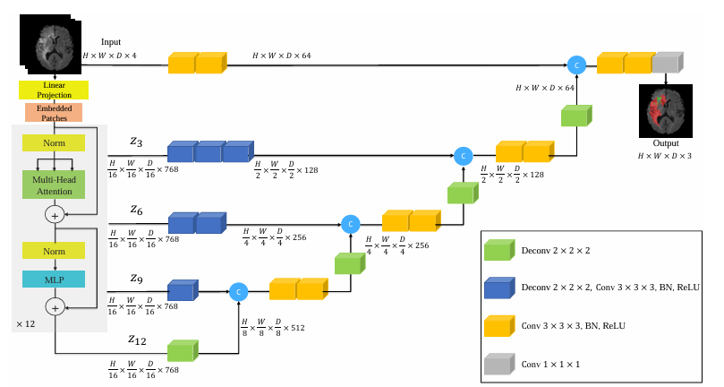
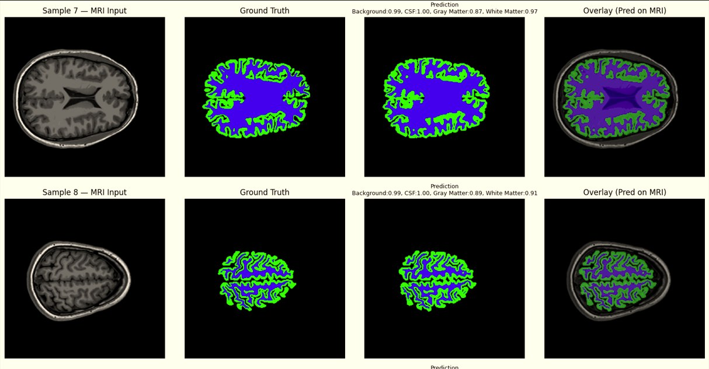
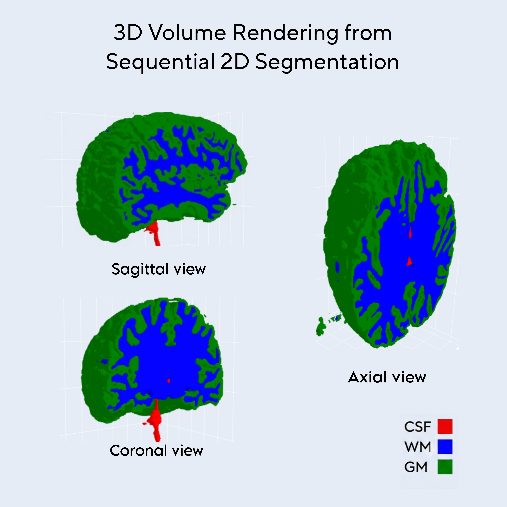
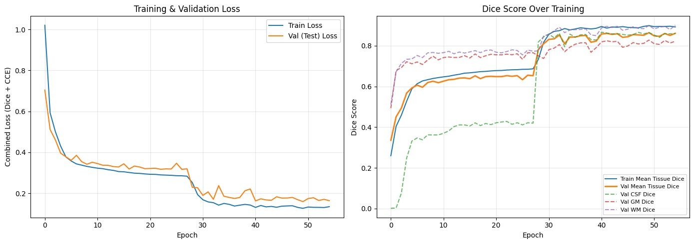

# 🧠 MRI Brain Tissue Segmentation with 2D UNETR

A Keras/TensorFlow implementation of a **2D UNETR** model for brain tissue segmentation from structural MRI, trained on the **ABIDE** dataset with FreeSurfer-derived labels.

---

## 📐 Model Architecture

### Original UNETR (3D, from the paper)

The original UNETR ([Hatamizadeh et al., 2021](https://arxiv.org/pdf/2103.10504)) was designed as a **3D** segmentation network. It combines a Vision Transformer (ViT) encoder with a CNN decoder in a U-Net-style skip-connection architecture.



> *Figure from the original UNETR paper — [arXiv:2103.10504](https://arxiv.org/pdf/2103.10504)*

Key characteristics of the original:
- Processes full **3D volumetric** patches
- Uses **12 Transformer encoder layers** with skip connections extracted at layers 3, 6, 9, and 12
- Designed for multi-organ segmentation (BTCV) and brain tumor segmentation (MSD)
- 3D convolutional decoder blocks

---


### Test Set Predictions



Each row shows: **MRI Input | Ground Truth | Prediction | Overlay**

Color legend: `Black = Background` · `Red = CSF` · `Green = Gray Matter` · `Blue = White Matter`

### 3D Visualization of 2D Segmentation



Stacking the 2D per-slice predictions reconstructs a volumetric segmentation of the brain, color-coded by tissue class.
---

### Our 2D Adaptation — Changes Made

This implementation adapts the UNETR architecture for **2D slice-based** brain MRI segmentation. The following changes were made compared to the original paper:

| Aspect | Original UNETR (3D) | This Implementation (2D) |
|---|---|---|
| **Input** | 3D volumetric patches `(H, W, D, C)` | 2D patches `(num_patches, patch_size² × C)` |
| **Encoder depth** | 12 Transformer layers | **9 Transformer layers** |
| **Skip connections** | Extracted at layers 3, 6, 9, **12** | Extracted at layers 3, 6, **9** (no z12) |
| **Convolutions** | 3D Conv + DeConv | **2D Conv + Conv2DTranspose** |
| **Patch flattening** | 3D → volumetric tokens | 2D → `(H//P × W//P)` spatial tokens |
| **Output classes** | Task-dependent | **4 classes**: Background, CSF, Gray Matter, White Matter |
| **Bottleneck** | z12 skip at highest resolution | z9 used as the bottleneck (deepest skip) |
| **Input channels** | RGB / multi-modal | **1 channel** (grayscale T1 MRI) |
| **Positional encoding** | Learnable 3D | Learnable **2D Embedding layer** |
| **MLP activation** | GELU | **GELU** (unchanged) |

#### Decoder Design

The decoder uses a progressive upsampling strategy with **concatenated skip connections** from z3, z6, z9, and the raw input z0:

```
z9 (bottleneck)
 └─ DeConv → concat(z6) → ConvBlocks
              └─ DeConv → concat(z3) → ConvBlocks
                           └─ DeConv → DeConv → concat(z0) → ConvBlocks
                                                               └─ Conv2D(4, softmax) → Output
```

Each `conv_block` is: `Conv2D → BatchNorm → ReLU` (the paper used GroupNorm; we use BatchNorm for compatibility).

---

## 📦 Dataset

- **ABIDE Initiative** — resting-state fMRI and structural MRI from individuals with ASD and neurotypical controls
- **Input**: FreeSurfer-processed `T1.mgz` volumes
- **Labels**: Derived from `ribbon.mgz` + `aseg.mgz` → 4-class tissue mask

| Class | Label | Source |
|---|---|---|
| Background | 0 | Complement |
| CSF | 1 | `aseg.mgz` (labels 4,5,14,15,24,43,44,72) |
| Gray Matter | 2 | `ribbon.mgz` (values 3, 42) |
| White Matter | 3 | `ribbon.mgz` (values 2, 41) |

---

## 🔧 Preprocessing Pipeline

1. **Download** T1.mgz + ribbon.mgz + aseg.mgz per subject from ABIDE S3
2. **Convert** to 4-class NIfTI mask
3. **Slice extraction** — iterate over all Y-axis slices; skip near-empty slices (no tissue labels)
4. **Normalization** — Z-score on brain-only voxels (non-zero), then rescale to [0, 1]; computed once per 3D volume
5. **Patchify** — reshape each 2D slice `(256, 256)` into `(256, 256)` patch tokens matching the UNETR input
6. **One-hot encode** masks to `(256, 256, 4)`
7. **Subject-level split** — 70% train / 10% val / 20% test (no data leakage across splits)

---

## ⚙️ Hyperparameters

| Parameter | Value |
|---|---|
| Image size | 256 × 256 |
| Patch size | 16 × 16 |
| Number of patches | 256 |
| Hidden dim | 256 |
| MLP dim | 512 |
| Attention heads | 4 |
| Key dim | 64 |
| Transformer layers | 9 |
| Dropout rate | 0.1 |
| Batch size | 8 |
| Optimizer | Adam (lr = 1e-4) |
| Epochs | 55 (with early stopping, patience = 15) |

---

## 📉 Loss Function

A combined loss was used to address class imbalance and boundary sharpness:

```
Loss = 1.2 × Categorical Cross-Entropy + 1.0 × Dice Loss
```

- **Dice Loss** captures region overlap — robust to class imbalance
- **CCE** enforces pixel-level probability calibration
- Background (class 0) is **excluded** from the monitoring metric (`mean_tissue_dice`) to avoid the metric being dominated by the easiest class

---

## 📊 Training Results

### Loss & Dice Curves



- Left: Combined loss (Dice + CCE) over epochs for train and validation
- Right: Mean tissue Dice + per-class Dice (CSF, GM, WM) over epochs
-  model results : val_csf_dice: 0.8579 - val_gm_dice: 0.8114 - val_loss: 0.1687 - val_mean_tissue_dice: 0.8510 - val_wm_dice: 0.8836


---

## 📚 Reference

> Hatamizadeh, A., Tang, Y., Nath, V., Yang, D., Myronenko, A., Landman, B., Roth, H.R., & Xu, D. (2021).
> **UNETR: Transformers for 3D Medical Image Segmentation**.
> *arXiv:2103.10504*. [https://arxiv.org/pdf/2103.10504](https://arxiv.org/pdf/2103.10504)
